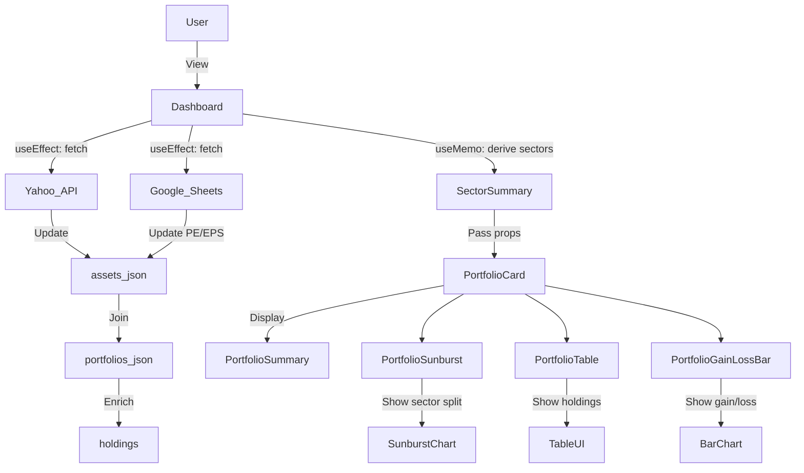

# 📈 Portfolio Dashboard (8byte.ai Assignment)

A fully responsive, visually insightful, and extensible portfolio dashboard built using **Next.js**, **TypeScript**, and **Tailwind CSS**, with real-time financial data integration and thoughtful UX features.

---

## 🚀 Features

- ✅ Real-time data fetch (Yahoo CMP, Google Sheet PE/Earnings)
- ✅ Grouped by sector with expandable/collapsible rows
- ✅ Sector-level aggregations (Investment, Portfolio %, Gain/Loss)
- ✅ Dynamic column rendering (type-based)
- ✅ Circular ring for Portfolio % (with external label)
- ✅ Gain/Loss with arrow + number + percentage
- ✅ Searchable, sortable, memoized for performance
- ✅ Responsive & scrollable (both X and Y)
- ✅ Fully generalized and scalable data model

---

## 🔧 Tech Stack

- **Frontend**: Next.js 14, React, TypeScript, TailwindCSS
- **Charting**: Recharts, @nivo/bar
- **Table**: @tanstack/react-table
- **API Fetch**: Axios, native fetch

---

## 📁 Folder Structure

```bash
src/
  ├── components/       # UI components
  ├── data/             # JSON files for assets, portfolios, etc.
  ├── pages/api/        # Yahoo & Google fetch endpoints
  ├── types/            # TS types/interfaces
  └── utils/            # Chart transformations & enrichers
```

---

## 🔄 Data Flow



---

## ⚙️ Local Setup

```bash
# Clone the repo
git clone https://github.com/kiranruba/Dynamic-Portfolio-Dashboard.git

# Go inside project folder
cd Dynamic-Portfolio-Dashboard

# Install dependencies
npm install

# Run dev server
npm run dev

```

---

## 🌐 API Endpoints

- `/api/yahoo`: Updates CMP using Yahoo Finance
- `/api/google`: Updates PE & EPS from Google Sheets (CSV)
- `/api/refresh`: Calls both in parallel and enriches data

---

## 📊 Sample Dashboard Output

- 💰 **Portfolio Value**: ₹1.8L present vs ₹1.67L invested  
- 📈 **Top Gainer**: `ICICI Bank` (+85.08%)  
- 📉 **Top Loser**: `Gensol` (−95.6%)  
- 🏢 **Sector Dominance**: `Financials` & `Tech` (~40%)  
- 📊 **Performance**: `13 of 29 stocks` in profit, contributing **24.9%**


---

## 🛆 Mock Data Files

- `assets.json`: Shared stock master data with CMP, PE, Earnings
- `portfolios.json`: Portfolio structure linked to assets
- `users.json`: Mock user structure

---

## 🖐️ Design Highlights

- Clean UI with collapsible sectors
- Icons for sorting and expanding
- Small indicators, no empty-cell dashes
- Circular Portfolio % charts (outer label only)
- Sticky left column for particulars (planned)

---

## 📘 Assignment Scope

- Only `type = stock` assets used
- Designed for easy future extension: Bonds, FDs, etc.
- SQL schema proposed for backend implementation

---

## 🧠 Architectural Thinking

- Shared `assets.json` → avoids duplication
- React hooks and `useMemo` for performance
- Separation of concerns between data, views, and config
- Visuals and KPIs carefully selected from available data

---

## 🛅 Feedback / Contributions

This project demonstrates full-stack integration, performance optimizations, and real-world business reasoning — built with interview readiness in mind.

Raise issues or suggestions via GitHub or connect directly for discussion!

